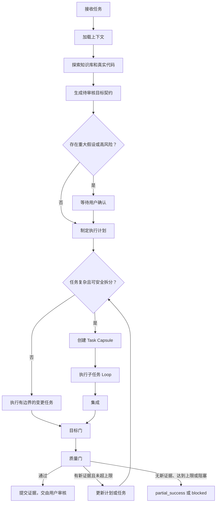

# Go 功能工作流统一设计

**日期：**2026-07-15
**状态：**已确认，等待实施计划
**范围：**将 Go 新功能开发和既有行为修改统一到 `$wf-go-feat`，完全移除 `go-modify-existing` / `$wf-go-mod` 工作流族。

## 背景

当前模板库对 Go 业务变更提供了两套高度重复的工作流：

- `$wf-go-feat`，对应 `go-feature-development`；
- `$wf-go-mod`，对应 `go-modify-existing`。

两者都需要相同的执行生命周期：探索项目知识和真实代码、明确目标、规划并实施改动、验证结果并提交证据。继续分别维护 workflow、graph、skill、command、catalog 和测试，会造成重复维护，并迫使用户在开始前判断请求属于“新功能”还是“修改已有功能”。

统一后的工作流必须更贴近实战，且稳定可维护：

- 实施前必须使用项目规则、技术 Profile 规则、项目 Overlay 规则和知识库路由；
- 用户需求模糊时，AI 必须主动补齐可审核的目标、方案和质检要求；
- 复杂任务可拆为有边界的任务，但任务拆分不等于必须使用 subagent；
- 每个任务和整个工作流都有清晰的目标门与质量门；
- 没有新证据或达到重试上限时，必须停止循环；
- 重大假设由用户审核，最终交付也由用户审核。

## 核心决策

保留 `$wf-go-feat` 作为唯一的 Go 业务变更工作流，并扩大其含义：

> `$wf-go-feat` 用于 Go 新功能、既有行为修改、跨文件业务调整和中等规模的 Go 开发任务。

完全删除 `go-modify-existing` / `$wf-go-mod`，**不保留兼容别名**。

工作流内部仍记录：

```text
changeKind: feature | modification
```

该分类只影响探索重点和质检重点；不再对应独立 workflow、skill、command、graph 或 catalog 项。

## 强约束

以下规则是 `$wf-go-feat` 的硬约束。除非用户明确授权例外，否则不得跳过、弱化或以“任务很简单”为由绕过。

### 1. 先探索，后方案，最后实施

在完成以下动作前，禁止修改业务代码、配置或测试：

```text
1. 加载项目指令与适用 Rules；
2. 读取知识库 routing，并加载路由指定的最少必要知识；
3. 搜索真实代码、调用方、测试和配置；
4. 生成待审核目标契约。
```

不得仅凭用户描述猜测现有实现或直接套用通用方案。

### 2. 目标与质检必须可审核

用户目标或质量要求不明确时，AI 必须根据知识库和真实代码主动补齐，并明确标注为“AI 假设”。不得以“需求不清楚”为由直接停在空泛追问，也不得把未经证据支持的业务猜测伪装成既定需求。

所有任务都必须有：

```text
目标
必须完成项
明确非目标
允许改动范围
验证方式
质量标准
风险
```

没有目标契约，不得开始实施。

### 3. 重大假设必须先确认

涉及业务语义选择、公共 API/协议、数据或配置迁移、删除旧行为、大范围重构、高风险文件，或只能由业务方定义的验收标准时，必须暂停并等待用户确认。不得以默认值、隐式选择或“最小改动”为理由绕过确认。

### 4. 拆任务必须有边界，subagent 必须有授权

拆出的每个任务必须具备独立目标、输入、允许修改范围、完成标准和验证方式。写入范围重叠或依赖未理清时，禁止并行拆分。

任务拆分默认由主线程串行执行。使用 subagent 必须同时满足：

```text
- 用户明确要求并行、分工或 delegation；
- 子任务写入范围不重叠；
- 主线程仍负责集成、最终 diff 审查和最终验证。
```

### 5. 目标门和质量门不得省略

任何实现或子任务完成后都必须先过目标门，再过质量门：

```text
目标门：目标契约中的所有必须完成项是否有证据证明已完成？
质量门：规则、范围、测试、构建、回归、风险和交付证据是否满足？
```

“代码已写完”“子任务报告完成”或“模型认为合理”不能作为通过依据。

### 6. Loop 必须受证据和上限约束

```text
父工作流最多 3 个完整 Loop；
每个子任务最多 2 次“实现-质检”尝试；
同一失败在没有新证据时不得重复两次。
```

重试必须记录新增证据、修正后的假设和下一次验证方式。没有新证据、超出目标契约或达到上限时，必须退出为 `partial_success` 或 `blocked`，不得无限重试。

### 7. 最终交付必须可复核

最终回复必须如实列出：

```text
已完成与未完成目标
改动文件
实际执行的命令与结果
未执行验证及其原因
需要用户审核的决策
剩余风险
最终状态
```

不得隐藏验证失败、环境阻塞、未经确认的假设或超出范围的改动。

## 路由边界

```text
Go 新功能                         -> $wf-go-feat
Go 既有行为修改                   -> $wf-go-feat
Go 跨文件业务调整                 -> $wf-go-feat
运行时失败 / 根因修复             -> $wf-go-bugfix
外部行为不变的结构性调整          -> $wf-go-refactor
只读理解 / 调研                   -> $wf-research
审查当前 diff                     -> $wf-go-review
```

## 工作流总览



## 工作流步骤

### Step 0：接收与初步分类

记录：

- 用户原始需求；
- 已知约束与禁止修改文件；
- 用户是否明确要求并行或 subagent；
- 初步的 `changeKind`，最终分类在探索后确认。

任务拆分不等于 subagent。默认由主线程串行推进。仅当用户明确要求并行、分工或 delegation，且任务边界独立、收益明确时，才考虑 subagent。

### Step 1：加载最少必要上下文

固定加载顺序：

```text
1. AGENTS.md 与项目指令
2. Go Profile Rules
3. 项目 Overlay Rules
4. design/KnowledgeBase/project/routing.md
5. routing 指向的最少量领域文档
6. 精确的代码、测试、配置、调用方和相似实现
```

规则：

- 优先精确搜索和 codegraph，再读取大文件；
- 不把完整知识库一次性塞进上下文；
- 简要报告实际加载了哪些规则和知识文件。

### Step 2：探索知识库和真实代码

进入计划前必须回答：

- 当前行为是什么；
- 用户期望行为是什么；
- 涉及哪些入口、调用方、数据流、配置和测试；
- 项目是否已有可复用的相似实现；
- 主要风险是什么；
- 如何验证。

如果用户描述与代码或知识库证据冲突，必须在目标契约中明确说明，不能静默选择一种解释。

### Step 3：AI 自动生成待审核目标契约

即使用户目标或质检要求不清晰，AI 也必须补齐：

```text
任务类型：
用户原始需求：
AI 理解后的目标：
必须完成的验收标准：
可选增强：
明确非目标：
预计改动范围和受影响调用方：
验证与质检标准：
关键假设及其证据：
风险：
是否需要用户确认：是/否，以及原因
```

质检要求可以是：

- **可量化的：**测试结果、构建结果、性能基线或调用次数；
- **可证据化的：**前后行为路径、代码与调用链审查、人工验收步骤、日志、截图或 review 结论。

没有可靠度量时，AI 不得虚构数值指标。

### Step 4：歧义与风险门

以下情况必须暂停，等待用户确认：

- 存在多个合理的业务解释；
- 产品规则、默认值、状态流转、奖励或经济规则未定义；
- 改动公共 API、协议、数据库 schema、配置格式或迁移；
- 需要删除或有意替换既有行为；
- 需要大范围重构；
- 只有业务负责人才能定义可接受的质量标准。

对于低风险且有充分代码/知识库依据的假设，AI 展示目标契约后可按推荐方案继续；用户始终保留最终交付审核权。

### Step 5：制定计划与决定是否拆任务

每个计划任务必须声明：

```text
目标
输入与依赖
允许修改范围
完成标准
验证方式
风险
```

只有同时满足以下条件才拆任务：

- 至少有两个可独立验证的交付物；
- 每个任务有清晰目标和验收标准；
- 写入范围不重叠，或依赖顺序明确；
- 拆分确实降低复杂度。

不应拆分的情况：

- 同一个核心数据流或状态机；
- 需求尚未稳定；
- 子任务必须反复读取彼此未完成的实现；
- 只是为了表面并行。

### Step 6：子任务 Loop

每个子任务携带一个紧凑的 Task Capsule：

```text
子任务目标：
依赖：
允许修改范围：
完成标准：
验证方式：
当前尝试次数：
已有证据：
已知风险：
```

子任务循环：

```text
最小探索 -> 最小实现 -> 子目标检查 -> 子任务质量检查
```

子任务必须返回：

```text
是否完成目标
改动文件
关键实现理由
验证命令与结果
剩余风险或阻塞项
```

子任务完成报告不是整体成功证明，必须由父任务集成。

### Step 7：集成

主线程统一检查：

- 子任务是否越界；
- 接口、数据流和错误处理是否一致；
- 是否存在集成冲突；
- 是否需要更新总目标契约；
- 最终验证范围是否完整。

### Step 8：目标门

目标门只验证：

> 目标契约中的全部“必须完成项”是否真的完成。

检查：

- 每个必须完成项是否有证据；
- 每个必需子任务是否完成；
- 非目标是否被意外触及；
- 调用方、配置和行为路径是否有遗漏。

处理方式：

- 缺少明确点：创建最小补充任务；
- 整体理解有误：返回探索和计划；
- 需要业务选择：等待用户确认。

### Step 9：质量门

所有改动必须满足：

```text
- 遵守项目指令、Rules 与 Overlay
- diff 最小且与目标相关
- 错误处理、边界处理与日志合理
- 无调试残留、秘密信息或禁止文件改动
- 实际执行并如实报告测试、构建和检查
- 明确记录失败或无法执行的验证
```

Go Profile 额外检查：

```text
- 受影响 package 的测试
- 必要时的 go build
- API / 协议 / 配置兼容性
- 并发、空值、超时、重试、幂等性风险
- 配置加载、错误传播和受影响调用方
```

当需求无法量化时，质量证据可以是：

```text
- 前后行为路径对比
- 调用链与 diff 证据
- 人工验收步骤
- 日志或截图
- Review 结论
- 已知风险与未覆盖范围
```

### Step 10：循环上限与退出

默认上限：

```text
父工作流：最多 3 个完整 Loop
每个子任务：最多 2 次“实现-质检”尝试
同一失败：没有新证据时禁止连续重复两次
```

一个完整 Loop 定义为：

```text
计划/拆解 -> 实施/集成 -> 目标门 -> 质量门
```

以下情况必须以 `partial_success` 或 `blocked` 退出：

- 达到重试上限；
- 同一失败重复且没有新证据；
- 环境、权限、外部服务阻塞验证；
- 下一步超出已审核目标契约，例如公共 API、迁移或大范围改造；
- 关键业务决策尚未得到用户确认。

最终输出必须包含：

```text
已完成目标
未完成目标
改动文件
验证命令与结果
需要用户审核的关键点
已知风险
状态：success / partial_success / blocked / failed / cancelled
```

## 其它工作流的优化定位

| 工作流 | 目标角色 | 优化方案 |
|---|---|---|
| `wf-go-feat` | Go 变更主工作流 | 使用本文定义的统一生命周期。 |
| `wf-go-mod` | 删除 | 不保留 alias、skill、command、workflow、graph、catalog 或测试。 |
| `wf-go-bugfix` | 诊断与修复 | 保持独立；强调复现和根因证据，复用目标门、质量门与循环上限。 |
| `wf-go-refactor` | 行为不变的结构调整 | 保持独立；目标契约固定“外部行为不变”，每阶段都必须可构建。 |
| `wf-go-review` | 独立或嵌入式质量门 | 可以独立审查 diff，也可作为高风险任务的逻辑/性能/安全质量门扩展。 |
| `wf-research` | 只读探索 | 输出 Change Brief：路径、证据、假设、风险和建议拆分；不直接实现。 |
| `wf-design` | 需求与方案决策 | 当业务规则或技术边界不清楚时，先产出可审核设计。 |
| `wf-subagents` | 执行策略 | 只用于边界独立的任务；不是默认业务入口。 |
| `wf-commit` | 终态交付门 | 仅在目标门和质量门都通过后使用。 |
| `wf-lark` | 集成 Profile | 按需加载外部系统能力，不与软件开发工作流竞争。 |
| `wf-kb-maintenance` | 知识库维护 | 检查路由、陈旧信息和重复硬规则，不直接实现业务改动。 |

## 需要修改的模板与 Catalog

修改：

```text
templates/workflows/go-feature-development.md
templates/workflows/go-feature-development.graph.json
templates/skills/codex/wf-go-feat/SKILL.md
templates/rules/go-00-routing.md
templates/commands/claude/wf-go-feat.md
internal/catalog/...
internal/httpapi/... 的测试和 catalog 测试
```

删除：

```text
templates/workflows/go-modify-existing.md
templates/workflows/go-modify-existing.graph.json
templates/skills/codex/wf-go-mod/
templates/commands/claude/wf-go-mod.md
```

同时删除所有 `go-modify-existing`、`modify-existing` 和 `wf-go-mod` 的：

- catalog 映射；
- skill 引用；
- command projection；
- UI/API 预期；
- 项目同步预期；
- 测试。

## 非目标

- 不将 bugfix 或 refactor 合并进 `$wf-go-feat`；
- 不让 subagent 成为默认执行方式；
- 不将 BTD 特有的 PMT/SSH 运维规则复制到全局 Go Profile；
- 不用通用 checklist 替换 Go 和 Unity 各自的 Profile 规则和验证方式。
