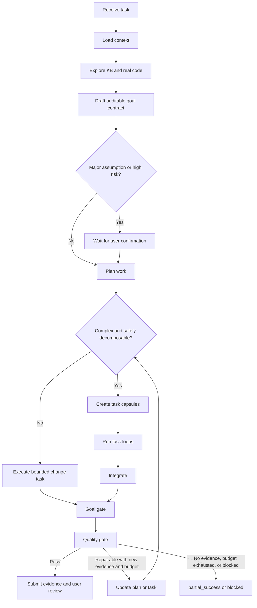

# Go Feature Workflow Unification Design

**Date:** 2026-07-15  
**Status:** Approved for implementation planning  
**Scope:** Unify Go feature development and existing-behavior modification under `$wf-go-feat`; remove the `go-modify-existing` / `$wf-go-mod` workflow family.

## Context

The template library currently exposes two nearly identical Go change workflows:

- `$wf-go-feat` backed by `go-feature-development`;
- `$wf-go-mod` backed by `go-modify-existing`.

Both workflows need the same operational lifecycle: inspect project knowledge and real code, define a goal, plan and implement changes, verify results, and provide evidence. Keeping separate workflow, graph, skill, command, catalog, and test surfaces creates duplicated maintenance and forces users to classify a request as "new" versus "existing" before work starts.

The unified workflow must work reliably for real project work. In particular, it must:

- use project rules, profile rules, project overlays, and knowledge-base routing before implementation;
- make a concrete, auditable plan even when the request is initially vague;
- decompose complex work into bounded tasks without treating every task split as subagent delegation;
- make each task and the parent workflow pass explicit goal and quality gates;
- stop retrying when new evidence is unavailable or a bounded retry budget is exhausted;
- leave human approval for significant assumptions and final acceptance.

## Decision

Keep `$wf-go-feat` as the sole Go business-change workflow and broaden its meaning:

> `$wf-go-feat` handles new Go features, existing Go behavior changes, cross-file business adjustments, and medium-sized Go development tasks.

Remove the `go-modify-existing` / `$wf-go-mod` family completely. Do not retain a compatibility alias.

The workflow internally records:

```text
changeKind: feature | modification
```

This classification influences exploration and verification emphasis only. It does not select a separate workflow, skill, command, graph, or catalog item.

## Routing Boundaries

```text
New Go feature                         -> $wf-go-feat
Existing Go behavior modification      -> $wf-go-feat
Cross-file Go business adjustment      -> $wf-go-feat
Runtime failure/root-cause repair      -> $wf-go-bugfix
Behavior-preserving structural change  -> $wf-go-refactor
Read-only understanding/research       -> $wf-research
Diff review                            -> $wf-go-review
```

## Workflow Lifecycle



### 0. Receive and classify

Capture the user request, known constraints, prohibited files, and whether the user explicitly requested parallel or delegated work. Infer `changeKind` after initial exploration.

Task decomposition does not imply subagent use. The main thread executes sequentially by default. Subagents are only considered when explicitly requested or when independently bounded work has a clear benefit and is permitted by the execution environment.

### 1. Load minimum necessary context

Load in this order:

1. `AGENTS.md` and project instructions;
2. Go profile rules;
3. project overlay rules;
4. `design/KnowledgeBase/project/routing.md`;
5. only the domain documents selected by routing;
6. precise code, tests, configuration, call sites, and existing analogous implementations.

Prefer precise search and code graph exploration before reading large files. Report the loaded rule and knowledge paths.

### 2. Explore knowledge and real code

Before planning, establish:

- current behavior;
- requested behavior;
- relevant entry points, call sites, data flow, configuration, and tests;
- existing analogous implementations;
- known risks;
- practical verification methods.

When the user request conflicts with evidence from code or the knowledge base, surface the conflict in the goal contract rather than silently choosing one interpretation.

### 3. Draft an auditable goal contract

The AI must draft a contract even when the request or quality requirements are vague:

```text
Task type:
User request:
AI-understood objective:
Required completion criteria:
Optional enhancements:
Explicit non-goals:
Expected change scope and affected callers:
Verification and quality criteria:
Key assumptions and supporting evidence:
Risks:
User confirmation required: yes/no, with reason
```

Quality criteria may be quantitative (tests, build, performance baseline) or evidence-based (before/after behavior paths, code and call-chain review, manual acceptance steps, logs, screenshots, or review findings). The AI must not invent a numerical metric when no reliable measurement exists.

### 4. Ambiguity and risk gate

Pause for user confirmation when any of these apply:

- more than one reasonable business interpretation exists;
- product rules, defaults, state transitions, rewards, or economics are undefined;
- public APIs, protocols, database schemas, configuration formats, or migrations change;
- existing behavior must be removed or intentionally replaced;
- a broad refactor is required;
- only a business owner can define acceptable quality.

For low-risk, well-supported assumptions, present the contract and continue with the recommended approach. The user always retains final delivery review.

### 5. Plan and decompose

Every planned task must declare:

- objective;
- inputs and dependencies;
- allowed edit scope;
- completion criteria;
- verification;
- risks.

Split work only when there are two or more independently verifiable deliverables, the write scopes do not overlap (or their dependency order is explicit), and decomposition reduces complexity.

### 6. Task loop

Each child task carries a compact task capsule:

```text
Task objective:
Dependencies:
Allowed edit scope:
Completion criteria:
Verification:
Current attempt:
Evidence:
Known risks:
```

The task loop is:

```text
minimal exploration -> minimal implementation -> task goal check -> task quality check
```

A task returns its completion status, changed files, implementation rationale, verification results, and residual risks. Parent integration is required; a task completion report is not proof of whole-workflow success.

### 7. Integrate

The parent workflow checks task boundaries, interfaces, data flow, error handling, conflicts, and total verification scope. It updates the goal contract when integration changes a previously stated assumption.

### 8. Goal gate

Verify that every required completion criterion in the contract is satisfied, every required task is complete, non-goals were not unintentionally changed, and relevant call sites, configuration, and behavior paths are covered.

If the goal gate fails, create the smallest necessary follow-up task. Return to exploration if the overall understanding is incorrect. Pause for user confirmation if a business decision is required.

### 9. Quality gate

All changes must satisfy:

- project instructions, rules, and overlays;
- minimal and relevant diff scope;
- appropriate error handling, boundary handling, and logging;
- no debug residue, secrets, or forbidden-file edits;
- executed and accurately reported tests, builds, and checks;
- explicit classification of failed or unavailable validation.

The Go profile quality gate additionally checks affected package tests, necessary builds, API/protocol/configuration compatibility, concurrency/null/timeout/retry/idempotency risks, configuration loading, error propagation, and affected callers.

### 10. Retry budget and exit

Default limits:

```text
Parent workflow: at most 3 complete loops
Each task: at most 2 implementation-quality attempts
Same failure: never repeat twice without new evidence
```

Exit with `partial_success` or `blocked` when the retry budget is exhausted, no new evidence exists, the environment or permissions block validation, or the next action exceeds the approved contract.

Final output contains completed and unfinished objectives, changed files, commands and results, user review items, risks, and one of:

```text
success | partial_success | blocked | failed | cancelled
```

## Other Workflow Optimization

| Workflow | Target role | Optimization |
|---|---|---|
| `wf-go-feat` | Primary Go change workflow | Unified lifecycle described above. |
| `wf-go-mod` | Removed | No alias, skill, command, workflow, graph, catalog item, or tests remain. |
| `wf-go-bugfix` | Diagnose and repair | Keep independent; require reproduction and root-cause evidence, then reuse goal/quality gates and bounded loops. |
| `wf-go-refactor` | Behavior-preserving structural work | Keep independent; contract fixes external behavior as unchanged and each stage remains buildable. |
| `wf-go-review` | Standalone or embedded quality gate | Use independently for a diff or as a high-risk quality-gate expansion with logic/performance/security review. |
| `wf-research` | Read-only discovery | Produce a change brief with relevant paths, evidence, assumptions, risks, and recommended task decomposition; do not implement. |
| `wf-design` | Decision and design workflow | Resolve unclear product or technical decisions before work enters the change lifecycle. |
| `wf-subagents` | Execution strategy | Invoke only for independently scoped tasks; not a default business workflow. |
| `wf-commit` | Terminal delivery gate | Run only after goal and quality gates pass. |
| `wf-lark` | Integration profile | Load as needed for external system operations rather than competing with software-development workflows. |
| `wf-kb-maintenance` | Knowledge-base maintenance | Validate routing, stale information, and duplicated hard rules without implementing business changes. |

## Required Template and Catalog Changes

Modify:

```text
templates/workflows/go-feature-development.md
templates/workflows/go-feature-development.graph.json
templates/skills/codex/wf-go-feat/SKILL.md
templates/rules/go-00-routing.md
templates/commands/claude/wf-go-feat.md
internal/catalog/...
internal/httpapi/... tests and catalog tests
```

Remove:

```text
templates/workflows/go-modify-existing.md
templates/workflows/go-modify-existing.graph.json
templates/skills/codex/wf-go-mod/
templates/commands/claude/wf-go-mod.md
```

Also remove all `go-modify-existing`, `modify-existing`, and `wf-go-mod` catalog mappings, skill references, command projections, UI/API expectations, synchronization expectations, and tests.

## Non-Goals

- Do not merge bugfix or refactor into `$wf-go-feat`.
- Do not make subagent execution the default.
- Do not copy BTD-specific PMT/SSH operational rules into the global Go profile.
- Do not replace Go and Unity profile-specific rules or verification with a generic checklist.
