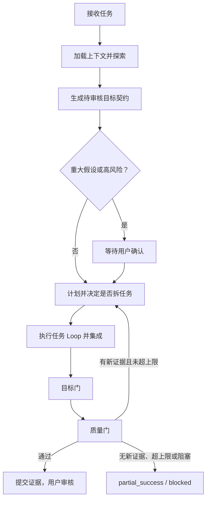

# Go 功能工作流统一设计

**日期：**2026-07-15
**状态：**已确认，等待实施计划

## 目标与决策

将 Go 新功能和既有行为修改统一到唯一入口 `$wf-go-feat`。

```text
新功能 / 修改既有行为 / 跨文件业务调整 -> $wf-go-feat
运行时故障和根因修复                 -> $wf-go-bugfix
外部行为不变的结构调整                -> $wf-go-feat（在目标契约中明确接口不变）
只读理解和调研                        -> $wf-research
审查当前改动                          -> $wf-go-review
```

删除 `go-modify-existing` / `$wf-go-mod`，不保留兼容别名。工作流内部可标记：

```text
changeKind: feature | modification
```

该标记只影响探索和质检重点，不再创建独立 workflow、skill、command、graph 或 catalog 项。

## 强约束

除非用户明确授权例外，以下规则不得跳过，也不得以“任务简单”为由弱化。

1. **先探索，后实施。** 修改前必须加载项目指令和适用 Rules，读取 KB routing 与必要领域文档，搜索真实代码、调用方、测试和配置，并生成目标契约。
2. **目标与质检必须可审核。** 用户描述不清晰时，AI 必须用代码和知识库证据补齐目标、质量标准和假设；不得停在空泛追问，也不得把猜测当作需求。
3. **重大假设必须确认。** 业务语义选择、公共 API/协议、数据或配置迁移、删除旧行为、大范围重构、高风险文件及业务验收标准，必须等待用户确认。
4. **任务必须有边界。** 每个任务都必须声明目标、输入、允许修改范围、完成标准、验证和风险。任务拆分默认由主线程串行执行。
5. **subagent 必须授权。** 仅当用户明确要求并行、分工或 delegation，且子任务写入范围不重叠时才可使用；主线程始终负责集成、最终 diff 审查和最终验证。
6. **目标门和质量门不可省略。** “代码写完”“测试看起来正常”或“子任务报告完成”都不能视为通过。
7. **Loop 受证据和上限约束。** 父工作流最多 3 个完整 Loop；每个子任务最多 2 次“实施-质检”尝试；无新证据时不得重复同一失败。
8. **最终交付必须可复核。** 必须如实列出完成情况、改动文件、实际命令和结果、未执行验证、待审核决策、风险及最终状态。

## 工作流



### 1. 加载上下文并探索

按以下顺序加载最少必要信息：

```text
AGENTS.md / 项目指令
-> Go Profile Rules
-> 项目 Overlay Rules
-> design/KnowledgeBase/project/routing.md
-> routing 指向的最少领域文档
-> 精确代码、测试、配置、调用方、相似实现
```

先精确搜索或 codegraph，再读大文件；不要把整个知识库放入上下文。探索必须确认当前行为、目标行为、受影响路径、已有模式、风险和验证方法。

### 2. 生成待审核目标契约

AI 必须输出：

```text
任务类型：feature / modification
用户原始需求：
AI 理解后的目标：
必须完成项：
明确非目标：
预计修改范围和受影响调用方：
验证与质量标准：
关键假设及其代码/KB 证据：
风险：
是否需要用户确认：是/否，以及原因
```

质量标准可以是可量化的测试、构建或性能数据；无法量化时，必须给出可审核证据，例如前后行为路径、调用链、人工验收步骤、日志、截图或 review 结论。

### 3. 确认、计划与拆分

遇到强约束第 3 条中的高风险或重大假设时，等待用户确认；其他低风险且有证据支持的假设可以按推荐方案继续。

复杂任务只有在存在多个可独立验收的交付物、写入范围不重叠或依赖顺序明确、且拆分能降低复杂度时才拆分。每个任务使用以下 Task Capsule：

```text
目标：
依赖：
允许修改范围：
完成标准：
验证方式：
当前尝试次数：
已有证据与风险：
```

### 4. 执行任务 Loop 与集成

每个任务遵循：

```text
最小探索 -> 最小实现 -> 子目标检查 -> 子任务质量检查
```

任务必须返回完成情况、改动文件、实现理由、验证结果和剩余风险。主线程负责检查任务边界、接口、数据流、错误处理、冲突和总体验证范围；子任务完成不等于整体完成。

### 5. 目标门

只判断目标契约中的全部“必须完成项”是否有证据证明完成，并检查：

- 必需子任务是否完成；
- 非目标是否被意外触及；
- 调用方、配置和行为路径是否遗漏。

未通过时，创建最小补充任务；若整体理解错误则回到探索；若需要业务选择则等待用户确认。

### 6. 质量门与退出

质量门检查：

```text
Rules 和项目约束
-> 最小且相关的 diff
-> 错误处理、边界和日志
-> 无调试残留、秘密信息或禁止文件改动
-> 实际执行并如实报告测试、构建和检查
-> Go 特有的 package 测试、兼容性、并发、超时、重试、幂等性和调用方风险
```

一个完整 Loop 是：

```text
计划/拆分 -> 实施/集成 -> 目标门 -> 质量门
```

达到上限、没有新证据、环境/权限/外部服务阻塞，或下一步超出已审核目标契约时，必须以 `partial_success` 或 `blocked` 退出，而不是无限重试。

最终状态只能是：

```text
success | partial_success | blocked | failed | cancelled
```

## 其它工作流的定位

| 工作流 | 定位 |
|---|---|
| `wf-go-feat` | 唯一的 Go 业务变更工作流。 |
| `wf-go-mod` | 完全删除。 |
| `wf-go-bugfix` | 独立的复现、根因与最小修复流程；复用目标门、质量门和循环上限。 |
| `wf-go-refactor` | 删除；结构调整通过 `$wf-go-feat` 执行，并在目标契约中明确外部接口不变与验证要求。 |
| `wf-go-review` | 可独立运行，也可作为高风险质量门扩展。 |
| `wf-research` | 只读；输出 Change Brief，供变更工作流使用。 |
| `wf-design` | 处理业务规则或技术边界不明确的设计决策。 |
| `wf-subagents` | 执行策略，不是默认业务入口。 |
| `wf-commit` | 目标门和质量门通过后的终态交付门。 |
| `wf-lark` | 按需加载的集成 Profile。 |
| `wf-kb-maintenance` | 维护 KB 路由、陈旧信息和重复硬规则，不直接实现业务改动。 |

## 实施范围

修改：

```text
templates/workflows/go-feature-development.md
templates/workflows/go-feature-development.graph.json
templates/skills/codex/wf-go-feat/SKILL.md
templates/rules/go-00-routing.md
templates/commands/claude/wf-go-feat.md
internal/catalog/... 及相关 catalog、HTTP、项目同步测试
```

删除：

```text
templates/workflows/go-modify-existing.md
templates/workflows/go-modify-existing.graph.json
templates/skills/codex/wf-go-mod/
templates/commands/claude/wf-go-mod.md
```

并删除所有 `go-modify-existing`、`modify-existing` 和 `wf-go-mod` 的 catalog 映射、skill 引用、command projection、UI/API 预期、项目同步预期和测试。

## 非目标

- 不将 bugfix 合并进 `$wf-go-feat`；
- 不让 subagent 成为默认执行方式；
- 不将 BTD 特有的 PMT/SSH 运维规则复制到全局 Go Profile；
- 不用通用 checklist 替换 Go 和 Unity 各自的 Profile 规则和验证方式。
